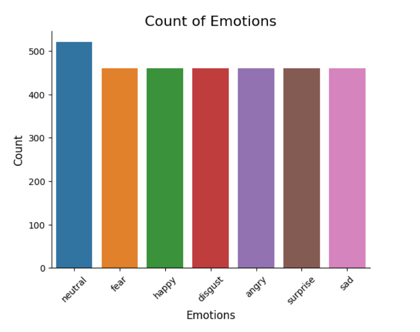

<h1 style="text-align: center;">Child Speech Emotion Recognition using Deep Learning</h1>

This project predicts emotions from child speech using machine learning and deep learning techniques. The model is trained on various datasets like TESS, SAVEE, RAVDESS, BESD, and CREMAD, commonly used for emotion recognition tasks.

<h2>Datasets Used</h2>
<ul>
  <li>CREMA-D</li>
  <li>RAVDESS</li>
  <li>SAVEE</li>
  <li>TESS</li>
</ul>

<h2>Project Workflow</h2>
    <ul>
        <li>
            <strong>1. Importing Libraries</strong>
            
The following libraries are used: <code>pandas</code>, <code>numpy</code>, <code>librosa</code>, <code>keras</code>, <code>scikit-learn</code>, <code>matplotlib</code>, and <code>seaborn</code>.

        </li>
        <li>
            <strong>2. Data Preparation</strong>
            
Data from multiple datasets is merged into a dataframe, storing emotion labels and file paths. This dataframe is then used to extract features for training the model.

        </li>
<li>
    <strong>2. Data Preparation</strong>
    
Data from multiple datasets is merged into a dataframe, storing emotion labels and file paths. This dataframe is then used to extract features for training the model.

</li>

  

  
<i>Fig-1: Emotions Combined</i>

        <li>
            <strong>3. Data Visualization and Exploration</strong>
            
Visualize the distribution of emotions using bar charts. Waveplots and Spectrograms are also used to analyze audio signals:

            <ul>
                <li><strong>Waveplots:</strong> Show loudness over time.</li>
              

              
              

              

              
<i>Fig-2: Waveplot for Fear Emotion</i>

              

                <li><strong>Spectrograms:</strong> Represent the frequency spectrum over time.</li>
              

              
              

              

              
<i>Fig-3: Spectrogram for Fear Emotion</i>

              
              
            </ul>
        </li>
        <li>
            <strong>4. Data Augmentation</strong>
            
Augmentation techniques to enhance generalization include:

            <ul>
                <li>Noise Injection</li>
                <li>Time Shifting</li>
                <li>Pitch Alteration</li>
                <li>Speed Changes</li>
            </ul>
        </li>
        <li>
            <strong>5. Feature Extraction</strong>
            
The audio features extracted include:

            <ul>
                <li>Zero Crossing Rate</li>
                <li>Chroma_STFT</li>
                <li>MFCC (Mel-frequency cepstral coefficients)</li>
                <li>RMS (Root Mean Square)</li>
                <li>MelSpectrogram</li>
            </ul>
        </li>
        <li>
            <strong>6. Data Preparation</strong>
            
Features are normalized and split into training and testing sets.

        </li>
        <li>
            <strong>7. Model Architecture</strong>
            
A CNN (Convolutional Neural Network) is built to classify emotions from speech.

        </li>
              

              
              

              

              
<i>Fig-4: Confusion metrics</i>

              
  
    </ul>

    <h2>Future Scope</h2>
              

              
              

              

              
<i>Fig-5: Predicted VS Actual</i>

              
  
    
Future improvements and explorations for this project may include:

    <ul>
        <li>Exploring additional datasets to enhance model accuracy.</li>
        <li>Implementing more advanced feature extraction techniques.</li>
        <li>Testing various architectures of deep learning models to improve classification performance.</li>
        <li>Integrating real-time emotion detection in applications such as educational tools and therapy.</li>
        <li>Conducting user studies to assess the practical applications and effectiveness of the model.</li>
    </ul>

